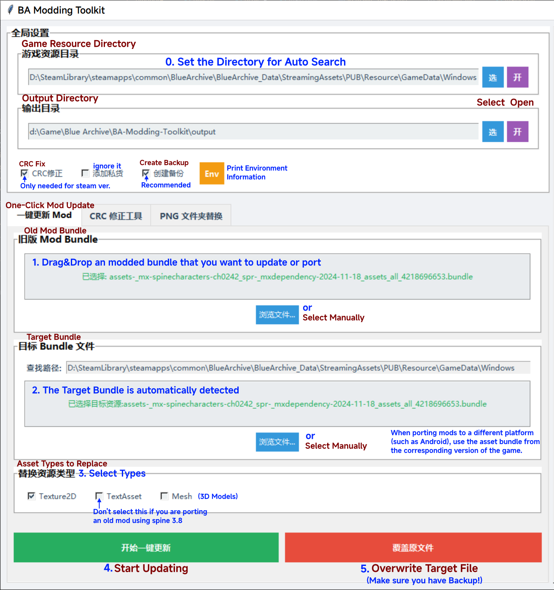

[](https://www.gnu.org/licenses/gpl-3.0)

# BA Modding Toolkit

> Sorry for my program being written in Chinese without i18n support, but I believe it's easy to use with this README.

[简体中文](README_zh-CN.md) | English

A toolkit for automating the creation and updating of Blue Archive Mod Bundle files.

## Getting Started

### Install Dependencies
```bash
pip install -r requirements.txt
```

### Run the Program
```bash
python main.pyw
```
Alternatively, you can double-click the `main.pyw` file to launch the program.

## Program Interface Description
The program contains multiple functional tabs:
- **一键更新 Mod** (One-Click Mod Update): Single Mod file update functionality
- **批量更新 Mod** (Batch Mod Update): Batch processing of multiple Mod files
- **CRC 修正工具** (CRC Fix Tool): CRC checksum correction functionality
- **资源文件夹替换** (Asset Folder Replacement): Replace asset files in Bundle with files from folder

Click the **Settings** button at the top of the main interface to open the advanced settings window.
The program can save user configurations to the `config.ini` file, which will be automatically restored upon next startup.

### Directory Settings
- **游戏根目录** (Game Root Directory): Set the game installation directory. The program can automatically detect resource subdirectories
- **输出目录** (Output Directory): Set the save location for generated files

### Global Options
- **CRC 修正** (CRC Fix): Automatically corrects the Bundle file's CRC checksum, preventing the file from being rejected after modification
    - Currently only required for Steam version Mods, can be ignored for other versions
- 添加私货: Add `0x08080808` before CRC correction. ~~You can ignore it lol~~
- **创建备份** (Create Backup): Creates a backup of the original file before overwriting it
- **压缩方式** (Compression Method): Select the compression method for Bundle files (LZMA, LZ4, Keep Original, No Compression)

### Resource Type Options
- **Texture2D**: Illustrations, textures, image resources
- **TextAsset**: `.atlas`, `.skel` files, Spine animation skeleton files
- **Mesh**: 3D model resources
- **ALL**: All types of resources (experimental, not recommended)

### Spine Converter (Experimental Feature)
Uses a third-party program to convert older Spine 3.8 format to the currently supported 4.2 format.
- You need to download the third-party Spine converter program yourself. BAMT only calls the program to convert Spine files, not provides the program itself.
- Download URL: [SpineSkeletonDataConverter](https://github.com/wang606/SpineSkeletonDataConverter/releases)
- Configure the path to `SpineSkeletonDataConverter.exe` in the settings interface, and check the "启用 Spine 转换" (Enable Spine Conversion) option.

**Note**: This is an experimental feature, not all mods can be successfully upgraded, suitable only for advanced users.

## How to Use



First, open the Settings window and configure the game root directory and output directory.

If you are updating or creating a Mod for the Steam version, check the "CRC 修正" (CRC Fix) option.

It is recommended to check the "创建备份" (Create Backup) option to prevent accidental overwriting of original files.

Click the "Save" button to save the configuration, which will be automatically restored upon next startup.

### 一键更新 Mod (One-Click Mod Update)
1. Drag and drop or browse to select the old Mod Bundle file that needs to be updated
2. The program will automatically find the corresponding target Bundle file in the resource directory
3. Check the resource types that need to be replaced in the settings window
4. Click the "开始一键更新" (Start One-Click Update) button, the program will automatically process and generate the updated Bundle file
5. (Optional) After success, click "覆盖原文件" (Overwrite Original File) to apply the modifications. Please ensure the "创建备份" (Create Backup) option is enabled to prevent risks.

This feature can also be used to port mods between different platforms, just select the Bundle file from the corresponding platform in step 2.

### 批量更新 Mod (Batch Mod Update)
1. Drag and drop or browse to select a folder containing multiple Mod files, or directly drag and drop multiple Mod files
    - The 4 buttons below are: 添加文件 (Add a File), 添加文件夹 (Add a Folder), 移除选中 (Remove Selected), 清空列表 (Clear List).
2. The program will automatically identify and list all processable Mod files
3. Configure resource types and other options in the settings window
4. Click the "开始批量更新" (Start Batch Update) button, the program will process all selected Mod files in sequence

### CRC 修正工具 (CRC Fix Tool)
1. Drag and drop or browse to select the target Bundle file that needs to be modified
2. The program will automatically find the corresponding original Bundle file in the resource directory
3. Click the "运行 CRC 修正" (Run CRC Fix) button: automatically corrects the Bundle file's CRC checksum
4. (Optional) After success, click "替换原始文件" (Replace Original File) to apply the modifications. Please ensure the "创建备份" (Create Backup) option is enabled to prevent risks.

The "计算CRC值" (Calculate CRC Value) button can be used to manually view the CRC checksum of a single file or two files.

### 资源文件夹替换 (Resource Folder Replacement)
1. Drag and drop or browse to select the folder containing replacement resources
    - Supported file types: `.png` (textures), `.skel`, `.atlas` (Spine animation files)
    - Ensure resource filenames match the resource names in the target Bundle file
2. Drag and drop or browse to select the target Bundle file that needs to be modified
3. Click the "开始替换" (Start Replacement) button: performs the resource replacement operation
4. (Optional) After success, click "覆盖原文件" (Overwrite Original File) to apply the modifications. Please ensure the "创建备份" (Create Backup) option is enabled to prevent risks.

This feature is for creating new Mods, such as quickly packaging modified resources into Bundle files.

## Developing

The author's programming skills are limited, welcome to provide suggestions or issues, and also welcome to contribute code to improve this project.

You can add `BA-Modding-Toolkit` code (mainly `processing.py` and `utils.py`) to your project or modify the existing code to implement custom Mod creation and update functionality.

`maincli.py` is a command-line interface (CLI) version of the main program, which you can refer to for calling processing functions.

### File Structure

```
BA-Modding-Toolkit/
├── main.pyw          # GUI program main entry point
├── ui.py             # GUI interface
├── maincli.py        # Command-line interface entry point
├── processing.py     # Core processing logic
├── utils.py          # Utility classes and helper functions
├── requirements.txt  # Python dependency list
├── config.ini        # Local configuration file (automatically generated)
├── assets/           # Project asset folder
└── README.md         # Project documentation (this file)
```

## Thanks

- [Deathemonic](https://github.com/Deathemonic): Patching CRC with [BA-CY](https://github.com/Deathemonic/BA-CY).
- [kalina](https://github.com/kalinaowo): Creating the prototype of the `CRCUtils` class, the starting point of BAMT.
- [afiseleo](https://github.com/fiseleo): Helping with the CLI version.
- [wang606](https://github.com/wang606): Spine version conversion feature based on [SpineSkeletonDataConverter](https://github.com/wang606/SpineSkeletonDataConverter) project.

This project uses the following excellent 3rd-party libraries:

- [UnityPy](https://github.com/K0lb3/UnityPy): Core library for parsing and manipulating Unity Bundle files
- [Pillow](https://python-pillow.org/): Used for processing texture resources in the game
- [tkinterdnd2](https://github.com/pmgagne/tkinterdnd2): Adds drag-and-drop functionality support for Tkinter